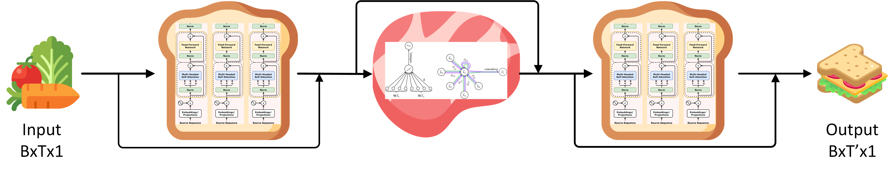

STGATT: Sandwich-style spatial temporal GNN for data imputation
---
### Architecture

### Experiments

#### Datasets
* 22June2020 (#samples 3600, #nodes 28)
* 29June2020 (#samples 7201, #nodes 25)
* SWaT: The Secure Water Treatment (SWaT) dataset is available for research purposes upon application. To apply for the SWaT dataset, please visit [iTrust Datasets](https://itrust.sutd.edu.sg/itrust-labs_datasets/dataset_info/) and follow the application instructions provided, or contact the dataset providers directly for further assistance.

#### Preprocessing
* Min-max scale

#### Settings and Metrics
* Train:Val:Test 70:10:20
* context length=16 (each training example length is of 16)

##### Experiment 1.
* Set context length to be 16, missing rate to be 0.5 which means there's 50% value missing for a sensor. 
* Compare MSE, MAE, RMSE with baselines

##### Experiment 2.
* After training with context length=16, missing rate=0.5
* To explore the robustness of STGATT, we test the trained model under different missing rate. [0.2,0.3,...,0.8]
  
##### Metrics
* MSE
* MAE
* RMSE

#### Baselines
* FFN
* BGRU
* Transformer (EncoderOnly)
* TGCN (T-GCN_A_Temporal_Graph_Convolutional_Network_for_Traffic_Prediction)

#### Analysis
* MLP performs worst without doubt
* BGRU and Transformer achieve comparable results, as the data changes smoothly, meaning its a simple task. Or the addition of GNN introduces additional noise when the task is too simple or spatial information doesn't provide enough useful information than noise introduced by itself)
* STGATT performs well as missing rate changes, indicating its robustness under dynamic settings.

### Contributions
* We proposed a attention based spatial temporal GNN method for data imputation
* A dynamic graph construction mechanism was introduced for a better spatial understanding
* Transformer with learnable positional encoding was utilized for capturing global and local temporal dependencies.
* Experiment results on two real-world datasets demonstrate the effectiveness of our model.

### Notes
* We use bidirectional attention (encoder-only) to capture a broader information.
* Positional encoding in Transformer is learnable
* In dynamic graphs generation, to keep the sparsity, we only select the most first 50% (hyper parameter) prominent edges (directed).

### Team members
1. Xuanhao Luo
2. Jinming Xing
3. Sai Vikas Reddy Yeddulamala
